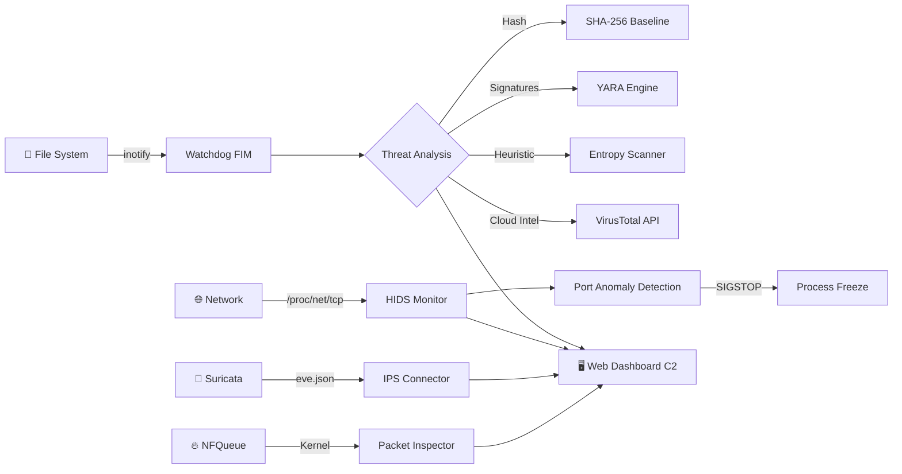

<div align="center">
  
  <h1>🛡️ Sentinel EDR</h1>
  <p><b>Advanced Host Intrusion Detection & Active Defense System</b></p>
  <p><i>DevSecOps & Blue Team — HIDS / FIM / IPS / Threat Intel</i></p>
  
  <p>
    
    
    
    
    
  </p>
</div>

---

## 📌 Overview

Modern SOC operations demand more than perimeter firewalls. **Sentinel EDR** is an open-source endpoint defense system that detects intrusions, neutralizes threats, and provides real-time forensic telemetry through a web command center.



## 🚀 Detection Engines

| Engine | Technology | Capability |
|--------|-----------|------------|
| **Watchdog FIM** | `inotify` + SHA-256 | Real-time file integrity monitoring with atomic baseline persistence |
| **YARA Scanner** | `yara-python` | APT signature matching — backdoors, cryptominers, LOLBins, privilege escalation |
| **Entropy Analyzer** | Shannon Entropy | Ransomware detection via cryptographic entropy analysis (threshold: 7.9/8.0) |
| **Network HIDS** | `/proc/net/tcp` | Kernel-level socket monitoring with automatic `SIGSTOP` on rogue processes |
| **NFQueue IPS** | `netfilterqueue` | Inline packet inspection with data exfiltration prevention |
| **Suricata Connector** | `eve.json` tail | Real-time IPS alert integration with automatic IP blocking |
| **VirusTotal Cloud** | API v3 | Cloud threat intelligence with rate-limited queries (4 req/min) |
| **Web Dashboard** | Flask + REST API | Real-time C2 interface with dual-control threat extermination |

## ⚡ Quick Start

### Prerequisites
```bash
# Core (required)
python3 -m pip install watchdog flask flask-cors

# Optional engines
python3 -m pip install yara-python        # YARA signatures
python3 -m pip install netfilterqueue scapy  # Kernel IPS (requires root)
```

### Run

```bash
# 1. Create file integrity baseline
python3 sentinel.py -b /path/to/protect

# 2. Start monitoring (all engines boot automatically)
sudo python3 sentinel.py -m /path/to/protect
```

> **Dashboard** opens automatically at `http://127.0.0.1:1337` — or open `dashboard/index.html` directly.

### Using the startup script
```bash
chmod +x start.sh
sudo ./start.sh -m /path/to/protect
```

## 🕹️ Dual-Control Response

Threats can be neutralized through **two independent channels**:

**Via Dashboard (Web C2):**
- Real-time threat cards with `EXTERMINATE` buttons
- Adaptive radar visualization (green → red during attacks)
- Engine health monitoring

**Via Terminal (CLI):**
```bash
[⚠️ REDE ALERTA] Backdoor Escutando TCP (4444)!
  └─> 🔬 Forense: Processo [nc] operando no PID (13238)
  └─> ❄️ AMEAÇA CONGELADA (SIGSTOP)!
  └─> ⚠️ Deseja MATAR o programa 'nc'? [S/N]: s
  └─> 💥 ALVO DERRUBADO!
```

## ⚙️ Configuration

Create `sentinel_config.json` (already in `.gitignore`):

```json
{
    "vt_api_key": "YOUR_KEY",
    "entropy_threshold": 7.9,
    "trusted_ips": ["10.0.0.1", "127.0.0.1"],
    "trusted_domains": ["google.com", "microsoft.com"],
    "trusted_ip_ranges": ["10.0.0.", "192.168."],
    "dashboard_port": 1337,
    "natural_entropy_extensions": ["png", "jpg", "zip", "pdf", "mp4"],
    "malicious_extensions": ["locked", "enc", "crypt", "ransom"]
}
```

Or set environment variable: `export VT_API_KEY=your_key`

## 🔒 Security Hardening (v10)

- **Atomic baseline writes** — prevents data corruption on crash
- **Log rotation** — 5MB max with 3 backup files
- **Config validation** — rejects invalid ports and thresholds
- **VT rate limiting** — respects free tier (15s between requests)
- **Signal handling** — graceful cleanup on `SIGTERM`/`SIGINT`
- **XSS protection** — HTML escaping on dashboard
- **CORS hardening** — restricted to localhost origins

---

`Engineered by` **[@Theus-TI](https://github.com/Theus-TI)**
